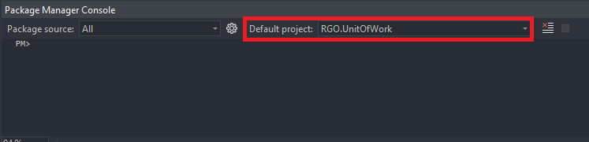
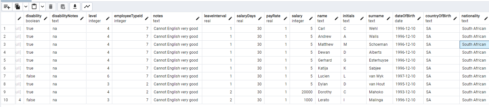

# Introduction

This system is an employee management system for Retro Rabbit Specificaly this is the back end for said system and works in conjuncture with the Front End repo

# Getting Started

### Cloning the [repository](https://retro-rabbit@dev.azure.com/retro-rabbit/RetroGradOnboard/_git/RGO-Server)

```powershell
git clone 'https://retro-rabbit@dev.azure.com/retro-rabbit/RetroGradOnboard/_git/RGO-Server'
```

Runs on(.NET Web API):

- https://localhost:7026
- http://localhost:5193

## Docker

### Install Docker

- https://www.docker.com/products/docker-desktop/
- If you don't use **WSL/Ubuntu** subsystem install Docker using the **Hyper-V** installation
- If new installation follow default settings for install

### Incorrect WSL version error

- If you get a WSL wrong version error run the following command
```powershell
wsl --install
```

### Change to the Dev branch

Make sure to have Git installed to run any Git command lines.

```powershell
#cd RGO-Server\RGO Backend
git checkout develop
```

### Setting up docker container

```powershell
docker run --name RGO -e POSTGRES_PASSWORD=postgrespw -p 5432:5432 -d postgres
```

### Run migration

Open Visual Studio 2022 and open the RGO-Server project file. Pull up the nuget package manager console:
**_Tools_** -> **_NuGet Package Manager_** -> **_Package Manager Console_**
Make sure the **Default project** is **_RGO.UnitOfWork_**.

---



### Add new user
- To be able to log in add new Employee with your Retro Rabbit email to the TestData.cs
- Add new Migration for your user

```powershell
add-migration newMigrationYouCanChooseName
```

```powershell
Update-Database
```

### Checking new user added to the DB you made

Install **PgAdmin** beforehand. If you locally installed **_PostgreSQL_** be warned that it may interfear with your attempts to connect to the database(Docker).
https://www.pgadmin.org/download/pgadmin-4-windows/

---

Register new RGO server


---

Update Information and save


---

Navigate to Employee table


Check if your new user is added



### Unit Test Coverage

With every pull request, there is a requirement to prove coverage of your code. Attached a screen shot of your code coverage to your PR description

```
Install the dotnet coverage tool
    dotnet tool install -g dotnet-coverage

Install the dotnet report generator tool
    dotnet tool install -g dotnet-reportgenerator-globaltool

Run the command to check coverage on your project
    dotnet-coverage collect -f xml -o coverage.xml dotnet test <solution/project>
    (<solution/project> can be omitted to test the entire project)

Generate report
    reportgenerator -reports:coverage.xml -targetdir:coverage/report

Navigate to the %temp% / report folder and open index.html using your prefered browser found at
    /RGO-Server/coverage/report/index.html
```

### FAQ

```typescript
// user type
enum UserType {
  GRAD = 0,
  PRESENTER,
  MENTOR,
  ADMIN,
}

// user status
enum UserStatus {
  NEW = 1,
  ACTIVE,
  INACTIVE,
}

// form status
enum FormStatus {
  NEW = 0,
  ACTIVE,
  INACTIVE,
}

// field type
enum FieldType {
  SIGNATURE = 0,
  FILEUPLOAD,
  DROPDOWN,
  TEXTAREA,
  TEXTBOX,
}

// stack type
enum StackType {
  DATABASE = 0,
  FRONTEND,
  BACKEND,
}

// event type
enum EventType {
  EVENTS = 0,
  WORKSHOPS,
}

// form type
enum FormType {}

// userStack typestatus
enum UserStackStatus {
  Saved = 1,
  Pending,
}
```
