# Introduction

This system is an employee management system for Retro Rabbit Enterprise Services. This is the back end for said system and works in conjuncture with the Front End repository

# Prerequisites
- [Visual Studio Community 2022](https://visualstudio.microsoft.com/vs/community/)
- [PgAdmin 4 (V8.6 or above)](https://www.pgadmin.org/download/pgadmin-4-windows/)
- [Node.js (v20.13.1 or above)](https://nodejs.org/en/download/prebuilt-installer)
- [Docker Desktop](https://www.docker.com/products/docker-desktop/)
- [Git (v2.45.1 or above)](https://git-scm.com/download/win)
- [Docker Desktop (Or any other git UI application)](https://desktop.github.com/)

# Getting Started

## Docker

Docker is used to run PostgreSql.

### Installing Docker

- If you don't use **WSL/Ubuntu** subsystem, install Docker using the **Hyper-V** installation
- If this is a new installation, follow the default settings for install

- If you get a `WSL wrong version error` run the following command 

```powershell
wsl --install
```

- Run the below command to install Postgres container in Docker
```powershell
docker run --name RGO -e POSTGRES_PASSWORD=postgrespw -p 5432:5432 -d postgres
```

```powershell
docker run -itd --name pgadmin -e PGADMIN_DEFAULT_EMAIL=admin@postgres.com -e PGADMIN_DEFAULT_PASSWORD=admin -p 80:80 dpage/pgadmin4
```

## Environment Variables
You need to add environment variables onto your machine.

| Variable name                      | Variable value |
| --------------------------         | -------------- |
| Auth__Audience                     | RGO Client     |
| Auth__Expires                      | 60             |
| Auth__Issuer                       | RGO API        |
| Auth__Key                          | ########       |
| ConnectionStrings__Default         | ########       |
| NewEmployeeQueue__ConnectionString | ########       |

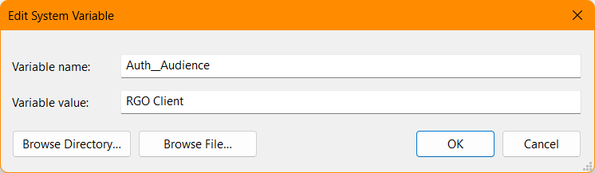
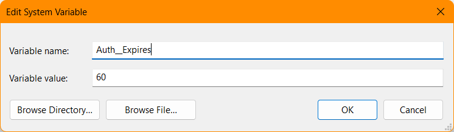
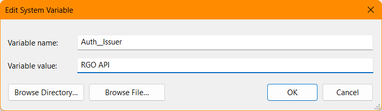
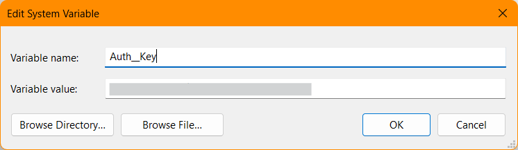

_With the respective values in the redacted (#######) spaces_

### Git

Make sure to have [Git](https://git-scm.com) installed to run any Git command lines.

### Cloning the [repository](https://github.com/RetroRabbit/RGO-Server.git)

```powershell
git clone 'https://github.com/RetroRabbit/RGO-Server.git'
```

Make sure to `checkout` develop branch

```powershell
git checkout develop
```

## User Secrets
Open the project/solution in Visual Studio. _(If you had visual studio opened when doing environment variables. Please restart visual studio)_

Right Click ``RGO.App`` and Click on **Mange User Secrets**.
This will open your ``secrets.json`` file

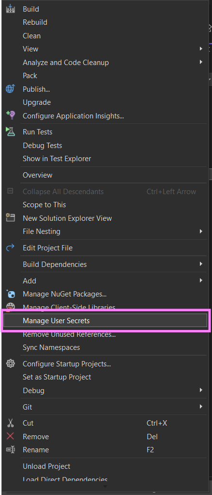

Paste the following in the file into ``secrets.json``
```json
{
  "ConnectionStrings": {
    "Default": ""
  },
  "Auth": {
    "Key": "",
    "Issuer": "",
    "Audience": "",
    "Expires": 60
  }
}
```

Replace the Connection strings, Auth Key, Auth Issuer and Auth Audience
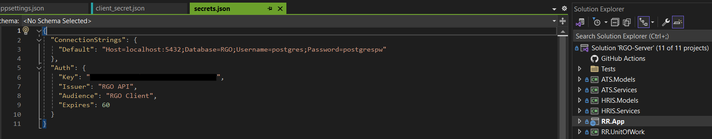


## pgAdmin

Launch pgAdmin. Register a **new server** on **pgAdmin**.

- Set the *Password* to "postgrespw". 
- Set the *Server Name* to "RGO".
- Set the *Host Name* to "localhost". 

1. Register **New Server** in pgAdmin

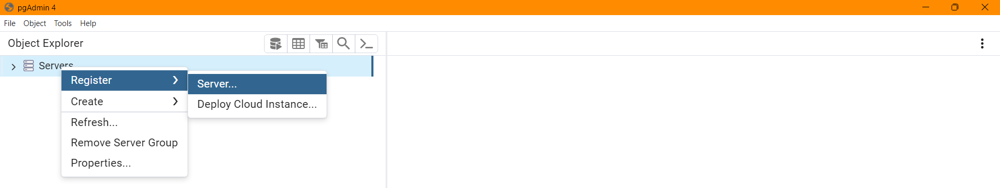

2. Update **Server Name** and **Host Name**

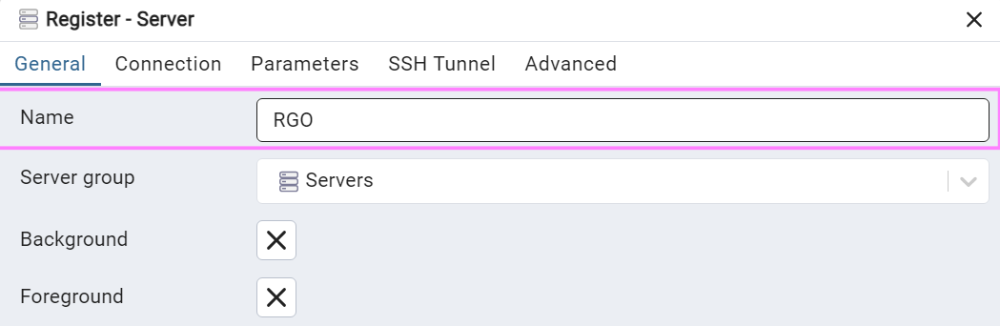
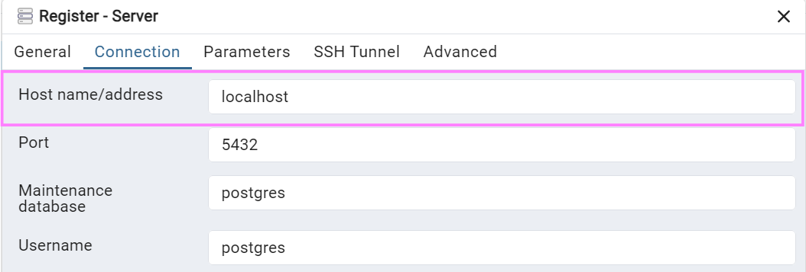

Note: If you get login issue
- Double check *Host Name* and *Password*
- Check that you are only running one instance of postgres on your machine. To check: run ```netstat -aon``` on the command line and check that port 5432 is only used once.


## Project Build and run

Right click on RR.App -> Dependencies -> Packages and Manage Nuget Packages. If the packages are highlighted with an exclamation mark then they still need to be restored. A popup should appear in this case and you can click "Restore".

Change from Production to Development in the drop down menu next to the play/debug button.

Note: You must have .net 7.0 as your target framework.

## EF Migrations

1. In Visual Studio->RGO-Server project/solution file. Pull up the nuget package manager console:
    
   **_Tools_** -> **_NuGet Package Manager_** -> **_Package Manager Console_**
2. Change the default project to RR.UnitOfWork.

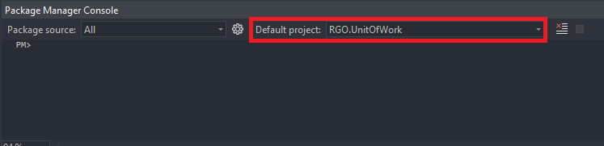

3. Run the following commands:
   
```powershell
update-database
```

🎉🌟 Congratulations! You have successfully created a database with tables!

## Populating Database with _Dummy Data_:

1. Make a local copy of the ``SEED_DUMMY.sql`` file In the RR.UnitOfWork Project.

   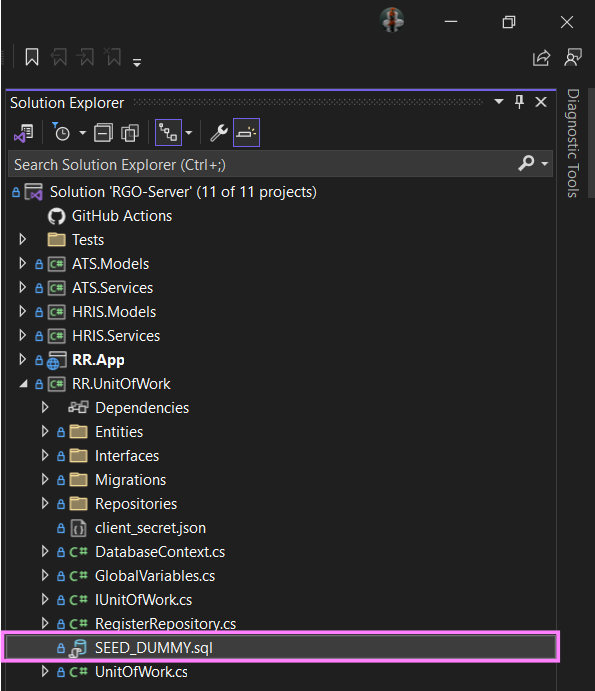

2. Copy one of the ``INSERT INTO Employee,`` statements in the script.
   
   
   
3. Paste a new INSERT statement and populate it with your information such as your email, 
   name, and surname. Also change the id of the record. 
   It is important to note that the first email field should be populated
   with a personal or work email you're going to use to log into the RGO system, otherwise 
   you won't have access to the system. The second email field can just be a dummy or
   additional email you'll make use of.

4. Copy one of the ``INSERT INTO RoleAccessLink,`` statements in the script, change the id and roleId to the role you want to assign to yourself.

4. Copy one of the ``INSERT INTO EmployeeRole,`` statements in the script, change the id, employeeId and roleId to the role you want to assign to yourself. employeeId should match the insert from ``Employee`` Table.
     
5. Copy the SQL in the locally created script.
   
6. Open **pgAdmin**, right-click on the RGO database, and select ``Query Tool``.
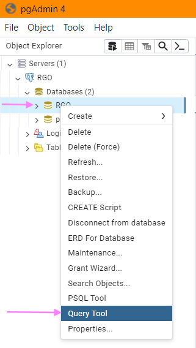

1. Paste the locally created script in the query screen that pops up. Click on ``Execute Script``.
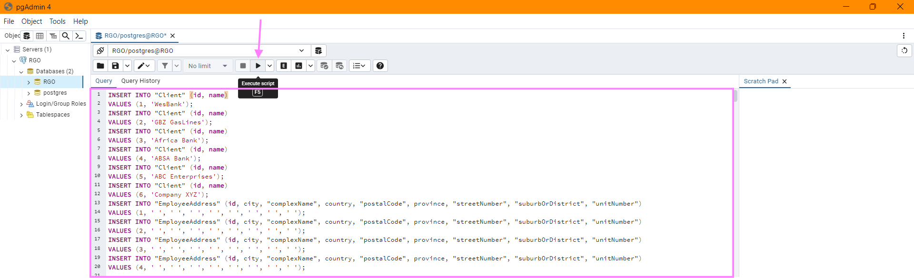


🎉🌟 Congratulations! You have a fully populated the database!

### Checking new user added to the DB you made

Once the query is completed successfully, you can go to the employee table and view all rows to see if you have data in the database.

# Notes

### Running Unit Tests

When running unit tests make sure that the database is running to accomodate for integration tests

### Unit Test Coverage

With every pull request, there is a requirement to prove coverage of your code. Attached a screen shot of your code coverage to your PR description

```powershell
Install the dotnet coverage tool
    dotnet tool install -g dotnet-coverage

Install the dotnet report generator tool
    dotnet tool install -g dotnet-reportgenerator-globaltool

Run the command to check coverage on your project
    dotnet-coverage collect -f xml -o coverage.xml dotnet test <solution/project>
    (<solution/project> can be omitted to test the entire project)

Generate report
    reportgenerator -reports:coverage.xml -targetdir:coverage/report

Navigate to the %temp% / report folder and open index.html using your prefered browser found at
    /RGO-Server/coverage/report/index.html
```

## Naming Conventions

### Endpoints
Use forward slash
Use forward slashes for resource hierarchy and to separate URI resources.
Example: "/employee/{id}"


### Use nouns, not verbs
When naming the URIs, you should use nouns to describe what the resource is and not what it does. For example:
Wrong:   "getEmployees/"
Correct: "employees/"

### Use plural nouns
This makes it clear that there is more than one resource within a collection. Using singular nouns can be confusing. For example:
Wrong:  "chart/{id}"
Correct: "charts/{id}"

### Lowercase letters
As a standard, URLs are typed in lowercase. The same applies to API URIs.


### Use hyphens to separate words
When chaining words together, hyphens are the most user-friendly way and are a better choice than underscores.
For example: "employee-documents/10"


### Endpoint strings can be the same provided that the Request Mapping is different:
PUT "employee/{id}"
GET "employee/{id}"

### Variables
All variables in methods must be in camelCase

Anything referenced by a service should prefixed with an underscore, to indicate that it is a reference to a service 

All Method names must be PascalCase
 ie: SaveEmployeeDocument(SimpleEmployeeDocumentDto employeeDocDto)

PS: When naming and endpoint, variable or method make the name as descriptive as possible. The only exception is for small scopes like a lambda.

### Project URL
Runs on(.NET Web API):

- https://localhost:7026
- http://localhost:5193
