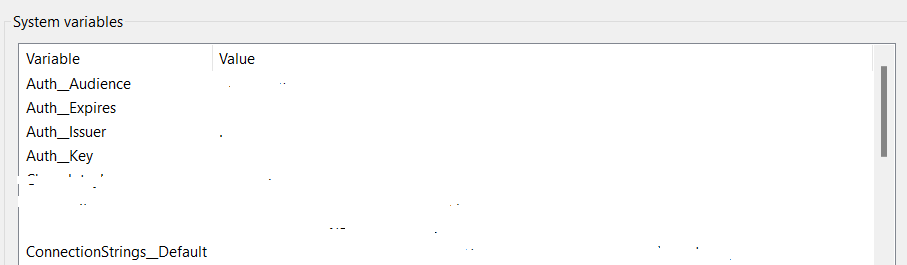
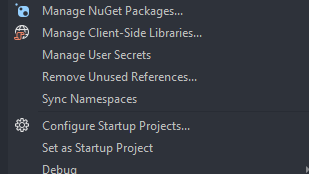
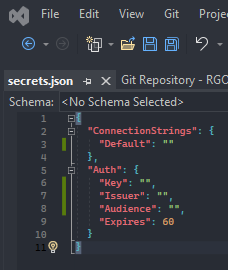
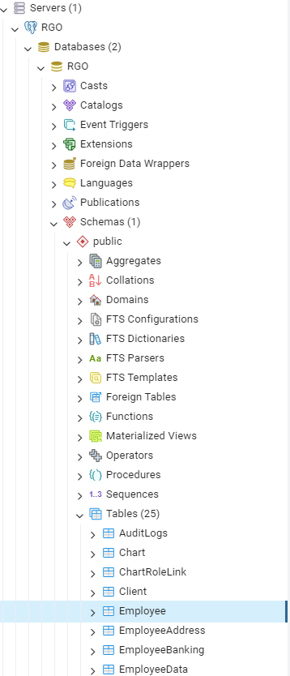

# Introduction

### NB!!! Make sure you're checked out on the develop branch

This system is an employee management system for Retro Rabbit Enterprise Services. This is the back end for said system and works in conjuncture with the Front End repository

# Getting Started

### Cloning the [repository](https://retro-rabbit@dev.azure.com/retro-rabbit/RetroGradOnboard/_git/RGO-Server)

```powershell
git clone 'https://retro-rabbit@dev.azure.com/retro-rabbit/RetroGradOnboard/_git/RGO-Server'
```

Runs on(.NET Web API):

- https://localhost:7026
- http://localhost:5193

## Docker

### Install Docker

- https://www.docker.com/products/docker-desktop/
- If you don't use **WSL/Ubuntu** subsystem install Docker using the **Hyper-V** installation
- If new installation follow default settings for install

### Incorrect WSL version error

- If you get a WSL wrong version error run the following command

```powershell
wsl --install
```

# Environment Variables
Add system environments as follows 



With the respective values in the redacted spaces 
(please note that the dashes in between the variable names are double dashes)

# User Secrets
Right Click RGO.App and Click on **Mange User Secrets**



This will open your secrets.json file



Paste the following in the file 

{
  "ConnectionStrings": {
    "Default": ""
  },
  "Auth": {
    "Key": "",
    "Issuer": "",
    "Audience": "",
    "Expires": 60
  }
}

Replace the Connection strings, Auth Key, Auth Issuer and Auth Audience

# pgAdmin

### Setup PgAdmin and Create Database

Install the latest version of PgAdmin. Then Register a new server on PgAdmin, name it RGO.
Password should be postgrespw. Set the host to localhost. You should be able to connect to the
RGO database after adding migrations and updating the DB in package manager console in
Visual Studios.


### Change to the Dev branch

Make sure to have Git installed to run any Git command lines.

```powershell
#cd RGO-Server\RGO Backend
git checkout develop
```

### Setting up docker container

```powershell
docker run --name RGO -e POSTGRES_PASSWORD=postgrespw -p 5432:5432 -d postgres

For RabbitMQ
docker pull rabbitmq:3-management
docker run --name r-mailing -it --hostname my-rabbit -p 15672:15672 -p 5672:5672 rabbitmq:3-management
```

### Add new user

- To be able to log in add new Employee with your Retro Rabbit email to the TestData.cs
- Add new Migration for your user

```powershell
add-migration newMigrationYouCanChooseName
```

### Populate DB with seeding data

- Drop your current RGO DB in pgAdmin
- Right-click on the postgres db in your explorer, and select the CREATE script option
- Copy the scripts inside CREATE_RGO.sql and run it
- Refresh your explorer, click on the RGO database inside the explorer.
- Once again, right-click on the database and select the CREATE script option
- Copy the scripts inside SEED_RGO.sql and run it

Congrats! Your DB is populated with data!

### Checking new user added to the DB you made

- Install **PgAdmin** beforehand. If you locally installed **_PostgreSQL_** be warned that it may interfear with your attempts to connect to the database(Docker).
- https://www.pgadmin.org/download/pgadmin-4-windows/

---

- Register new RGO server


---

- Update Information and save


---

- Navigate to Employee table



- Check if your new user is added

### Running Unit Tests

When running unit tests make sure that the database is running to accomodate for integration tests

### Unit Test Coverage

With every pull request, there is a requirement to prove coverage of your code. Attached a screen shot of your code coverage to your PR description

```
Install the dotnet coverage tool
    dotnet tool install -g dotnet-coverage

Install the dotnet report generator tool
    dotnet tool install -g dotnet-reportgenerator-globaltool

Run the command to check coverage on your project
    dotnet-coverage collect -f xml -o coverage.xml dotnet test <solution/project>
    (<solution/project> can be omitted to test the entire project)

Generate report
    reportgenerator -reports:coverage.xml -targetdir:coverage/report

Navigate to the %temp% / report folder and open index.html using your prefered browser found at
    /RGO-Server/coverage/report/index.html
```

# Naming Conventions
## Endpoints
Use forward slash
Use forward slashes for resource hierarchy and to separate URI resources.
Example: "/employee/{id}"


## Use nouns, not verbs
When naming the URIs, you should use nouns to describe what the resource is and not what it does. For example:
Wrong:   "getEmployees/"
Correct: "employees/"

## Use plural nouns
This makes it clear that there is more than one resource within a collection. Using singular nouns can be confusing. For example:
Wrong:  "chart/{id}"
Correct: "charts/{id}"

## Lowercase letters
As a standard, URLs are typed in lowercase. The same applies to API URIs.


## Use hyphens to separate words
When chaining words together, hyphens are the most user-friendly way and are a better choice than underscores.
For example: "employee-documents/10"


## Endpoint strings can be the same provided that the Request Mapping is different:
PUT "employee/{id}"
GET "employee/{id}"

## Variables
All variables in methods must be in camelCase

Anything referenced by a service should prefixed with an underscore, to indicate that it is a reference to a service 

All Method names must be PascalCase
 ie: SaveEmployeeDocument(SimpleEmployeeDocumentDto employeeDocDto)

PS: When naming and endpoint, variable or method make the name as descriptive as possible. The only exception is for small scopes like a lambda.
